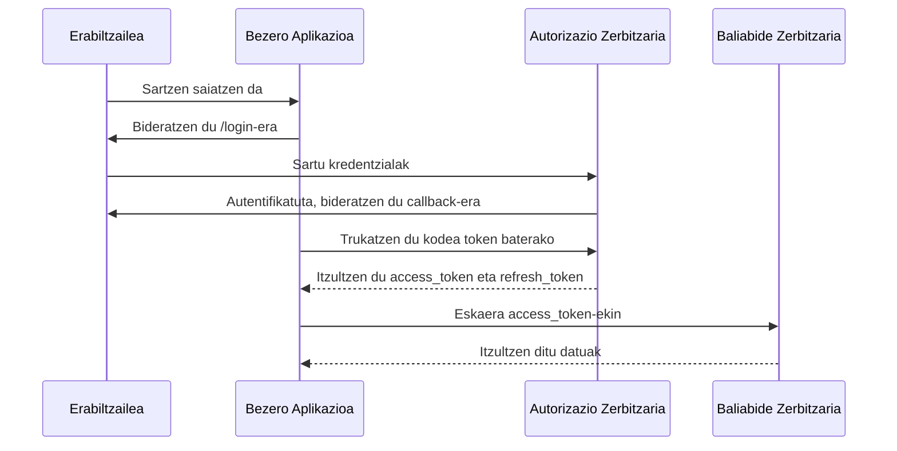

# 3.2 API Seguruak eta Autentifikazioa

## OAuth 2.0 eta OpenID Connect

### OAuth 2.0 Fluxu Osoa (Authorization Code Flow + PKCE)



### PKCE (Proof Key for Code Exchange) inplementazioa (React + Node.js)

**Bezeroaren aldea (React):**

```jsx
// PKCE kodea sortzeko funtzio lagungarriak
const generateRandomString = (length) => {
  const array = new Uint32Array(length);
  window.crypto.getRandomValues(array);
  return Array.from(array, dec => ('0' + dec.toString(16)).substr(-2)).join('');
};

const sha256 = async (plain) => {
  const encoder = new TextEncoder();
  const data = encoder.encode(plain);
  const hash = await window.crypto.subtle.digest('SHA-256', data);
  return Array.from(new Uint8Array(hash))
    .map(b => b.toString(16).padStart(2, '0'))
    .join('');
};

const base64URLEncode = (str) => {
  return btoa(String.fromCharCode.apply(null, new Uint8Array(str)))
    .replace(/\+/g, '-')
    .replace(/\//g, '_')
    .replace(/=+$/, '');
};

// Login funtzioan
const handleLogin = async () => {
  // 1. Sortu code_verifier eta code_challenge
  const codeVerifier = generateRandomString(64);
  const hashed = await sha256(codeVerifier);
  const codeChallenge = base64URLEncode(hashed);
  
  // 2. Gorde code_verifier sesioan
  sessionStorage.setItem('code_verifier', codeVerifier);
  
  // 3. Bideratu erabiltzailea autorizazio-endpointera
  const authUrl = new URL('https://auth.zure-zerbitzaria.com/authorize');
  const params = {
    response_type: 'code',
    client_id: 'zure_client_id',
    redirect_uri: window.location.origin + '/callback',
    code_challenge: codeChallenge,
    code_challenge_method: 'S256',
    scope: 'openid profile email',
    state: generateRandomString(16)
  };
  
  Object.keys(params).forEach(key => 
    authUrl.searchParams.append(key, params[key])
  );
  
  window.location.href = authUrl.toString();
};
```

**Zerbitzariaren aldea (Node.js + Express):**

```javascript
const express = require('express');
const { createHmac } = require('crypto');
const jwt = require('jsonwebtoken');

const app = express();
app.use(express.json());

// Datuak gordetzeko (produkzioan datu-base bat erabili)
const codeVerifiers = new Map();
const refreshTokens = new Map();

// 1. Autorizazio kodea itzuli
app.get('/authorize', (req, res) => {
  const { client_id, redirect_uri, code_challenge, state } = req.query;
  
  // Egiaztatu bezeroa eta redirect_uria
  if (client_id !== 'zure_client_id') {
    return res.status(400).send('Client ID desegokia');
  }
  
  // Gorde code_challenge (normalean sesio batean)
  const authCode = generateRandomString(32);
  codeVerifiers.set(authCode, {
    codeChallenge: code_challenge,
    clientId: client_id,
    redirectUri: redirect_uri,
    createdAt: Date.now()
  });
  
  // Erabiltzaileari erakutsi baimen-orria eta gero...
  // Erabiltzaileak baimena eman ondoren, redirect egiten du callback-era
  const redirectUrl = new URL(redirect_uri);
  redirectUrl.searchParams.append('code', authCode);
  redirectUrl.searchParams.append('state', state);
  
  res.redirect(redirectUrl.toString());
});

// 2. Trukaketa kodea token batekin
app.post('/token', async (req, res) => {
  const { client_id, code, code_verifier, redirect_uri, grant_type } = req.body;
  
  // Egiaztatu parametroak
  if (grant_type !== 'authorization_code') {
    return res.status(400).json({ error: 'grant_type baliogabea' });
  }
  
  // Egiaztatu kodea
  const codeData = codeVerifiers.get(code);
  if (!codeData) {
    return res.status(400).json({ error: 'Kodea baliogabea' });
  }
  
  // Egiaztatu code_verifier
  const hashed = await sha256(code_verifier);
  const codeChallenge = base64URLEncode(hashed);
  
  if (codeChallenge !== codeData.codeChallenge) {
    return res.status(400).json({ error: 'Code verifier desegokia' });
  }
  
  // Sortu tokenak
  const accessToken = jwt.sign(
    { sub: 'user123', client_id },
    process.env.JWT_SECRET,
    { expiresIn: '1h' }
  );
  
  const refreshToken = generateRandomString(64);
  refreshTokens.set(refreshToken, { 
    sub: 'user123',
    client_id,
    expiresAt: Date.now() + 30 * 24 * 60 * 60 * 1000 // 30 egun
  });
  
  // Ezabatu kodea berrerabiltzea eragozteko
  codeVerifiers.delete(code);
  
  // Itzuli tokenak
  res.json({
    access_token: accessToken,
    token_type: 'Bearer',
    expires_in: 3600,
    refresh_token: refreshToken,
    id_token: '...' // OpenID Connect kasurako
  });
});

// 3. Egiaztatu tokena (Resource Server)
function authenticateToken(req, res, next) {
  const authHeader = req.headers['authorization'];
  const token = authHeader && authHeader.split(' ')[1];
  
  if (!token) return res.sendStatus(401);
  
  jwt.verify(token, process.env.JWT_SECRET, (err, user) => {
    if (err) return res.sendStatus(403);
    req.user = user;
    next();
  });
}

app.get('/api/datuak', authenticateToken, (req, res) => {
  // Erabiltzailearen datuak itzuli
  res.json({ 
    message: 'Datuak lortu dira',
    user: req.user 
  });
});

// Laguntzaile funtzioak
function generateRandomString(length) {
  return require('crypto').randomBytes(length).toString('hex');
}

async function sha256(plain) {
  return createHmac('sha256', '').update(plain).digest('hex');
}

function base64URLEncode(str) {
  return Buffer.from(str, 'hex').toString('base64')
    .replace(/\+/g, '-')
    .replace(/\//g, '_')
    .replace(/=+$/, '');
}

const PORT = process.env.PORT || 3000;
app.listen(PORT, () => {
  console.log(`Zerbitzaria ${PORT} portuan entzuten...`);
});
```

## API Segurtasun Hobespenak (Security Headers)

### Helmet.js erabilita (Node.js)

```javascript
const express = require('express');
const helmet = require('helmet');

const app = express();

// Segurtasun-neurri orokorrak
app.use(helmet());

// Content Security Policy (CSP)
app.use(
  helmet.contentSecurityPolicy({
    directives: {
      defaultSrc: ["'self'"],
      scriptSrc: [
        "'self'",
        "'unsafe-inline'", // Saiestu hau kentzen ahal bezain laster
        "https://apis.google.com"
      ],
      styleSrc: ["'self'", "'unsafe-inline'"],
      imgSrc: ["'self'", "data:", "https://*.example.com"],
      connectSrc: ["'self'", "https://api.zure-zerbitzaria.com"],
      fontSrc: ["'self'", "https://fonts.gstatic.com"],
      objectSrc: ["'none'"],
      upgradeInsecureRequests: []
    }
  })
);

// X-XSS-Protection
app.use(helmet.xssFilter());

// MIME-type sniffing ekidin
app.use(helmet.noSniff());

// Clickjacking ekidin
app.use(helmet.frameguard({ action: 'deny' }));

// HSTS (HTTPS behartzea)
const oneYearInSeconds = 31536000;
app.use(helmet.hsts({
  maxAge: oneYearInSeconds,
  includeSubDomains: true,
  preload: true
}));

// X-Powered-By ezkutatu
app.use(helmet.hidePoweredBy());

// DNS Prefetch kontrola
app.use(helmet.dnsPrefetchControl({ allow: false }));

// X-Download-Options (IE8+) - kontu fitxategiak zabaltzeko modua kontrolatzeko
app.use(helmet.ieNoOpen());

// X-Content-Type-Options
app.use(helmet.noSniff());

// X-Permitted-Cross-Domain-Policies
app.use(helmet.permittedCrossDomainPolicies());

// X-Frame-Options
app.use(helmet.frameguard({ action: 'deny' }));

// XSS Filter (zaharkitua, baina bateragarritasunerako)
app.use((req, res, next) => {
  res.setHeader('X-XSS-Protection', '1; mode=block');
  next();
});
```

## API Segurtasun Hobespenak (Oso garrantzitsua!)

### 1. Sarrera balidazioa

```javascript
// express-validator erabiliz
const { body, validationResult } = require('express-validator');

app.post('/api/erabiltzaileak', [
  // Izena: 2-50 karaktere, letrak eta zuriuneak bakarrik
  body('izena')
    .trim()
    .isLength({ min: 2, max: 50 })
    .matches(/^[\p{L}\s]+$/u)
    .withMessage('Izenak 2-50 karaktere izan behar ditu eta letrak eta zuriuneak bakarrik'),
    
  // Emaila: baliozkoa izan behar da
  body('email')
    .isEmail()
    .normalizeEmail()
    .withMessage('Mesedez, sartu helbide elektroniko baliagarri bat'),
    
  // Pasahitza: 8+ karaktere, letra larri/ xehe bat, zenbaki bat eta karaktere berezi bat
  body('pasahitza')
    .isStrongPassword({
      minLength: 8,
      minLowercase: 1,
      minUppercase: 1,
      minNumbers: 1,
      minSymbols: 1
    })
    .withMessage('Pasahitzak gutxienez 8 karaktere, letra larri bat, xehe bat, zenbaki bat eta karaktere berezi bat izan behar ditu')
], async (req, res) => {
  // Egiaztatu balidazio-emaitzak
  const errors = validationResult(req);
  if (!errors.isEmpty()) {
    return res.status(400).json({ errors: errors.array() });
  }
  
  // Jarraitu prozesamendua
  try {
    // Erabiltzailea sortu...
    res.status(201).json({ message: 'Erabiltzailea ondo sortu da' });
  } catch (error) {
    console.error('Errorea erabiltzailea sortzean:', error);
    res.status(500).json({ error: 'Errorea zerbitzarian' });
  }
});
```

### 2. Rate Limiting (Atzipen-muga)

```javascript
const rateLimit = require('express-rate-limit');

// Oinarrizko rate limiting
const apiLimiter = rateLimit({
  windowMs: 15 * 60 * 1000, // 15 minutuko leihoa
  max: 100, // Leiho bakoitzeko gehienezko eskaera kopurua
  message: { error: 'Eskaera gehiegi, saiatu berriro beranduago' },
  standardHeaders: true, // Return rate limit info in the `RateLimit-*` headers
  legacyHeaders: false, // Disable the `X-RateLimit-*` headers
});

// APIrako muga aplikatu
app.use('/api/', apiLimiter);

// Erabiltzailearen araberako rate limiting
const userLimiter = rateLimit({
  windowMs: 60 * 60 * 1000, // Ordu 1
  max: async (req, res) => {
    // Erabiltzailearen IDa lortu (adibidez, tokenetik)
    const userId = req.user?.id || req.ip;
    
    // Erabiltzailearen plana lortu (adibidez, datu-base batetik)
    const userPlan = await getUserPlan(userId);
    
    // Planaren arabera itzuli muga
    switch (userPlan) {
      case 'free': return 100;
      case 'pro': return 1000;
      case 'enterprise': return 10000;
      default: return 100;
    }
  },
  keyGenerator: (req) => req.user?.id || req.ip,
  message: { error: 'Zure erabiltzaile-planak muga bat du orduko eskaeretan' }
});

app.use('/api/erabiltzaile/datuak', userLimiter);
```

### 3. Errore-kudeaketa segurua

```javascript
// Errore-kudeatzaile orokorra
app.use((err, req, res, next) => {
  console.error(err.stack);
  
  // Errore-mezu orokorra
  const response = {
    error: {
      message: 'Errorea zerbitzarian',
      code: 'internal_server_error',
      requestId: req.id // request-id header bat erabiliz
    }
  };
  
  // Garapenerako informazio gehiago
  if (process.env.NODE_ENV === 'development') {
    response.error.details = {
      message: err.message,
      stack: err.stack,
      ...err
    };
  }
  
  // HTTP egoera kodea
  const statusCode = err.statusCode || 500;
  
  // Erantzuna bidali
  res.status(statusCode).json(response);
});

// 404 kudeaketa
app.use((req, res) => {
  res.status(404).json({
    error: {
      message: 'Ez da baliabidea aurkitu',
      code: 'not_found',
      path: req.path
    }
  });
});
```

## Ariketa praktikoa

1. Inplementatu OAuth 2.0 + PKCE zure React/Node.js aplikazioan
2. Konfiguratu CSP zure webgunean eta probatu Content-Security-Policy-Report-Only
3. Egiaztatu zure API-aren segurtasuna OWASP ZAP edo Burp Suite erabiliz
4. Inplementatu rate limiting zure API kritikoetan

## Hurrengo urratsak

- [Tresna praktikoak eta segurtasun-ebaluazioa](tresnak.md)
- [Atzera itzuli aurreko atalera](datu_sentikorrak.md)
